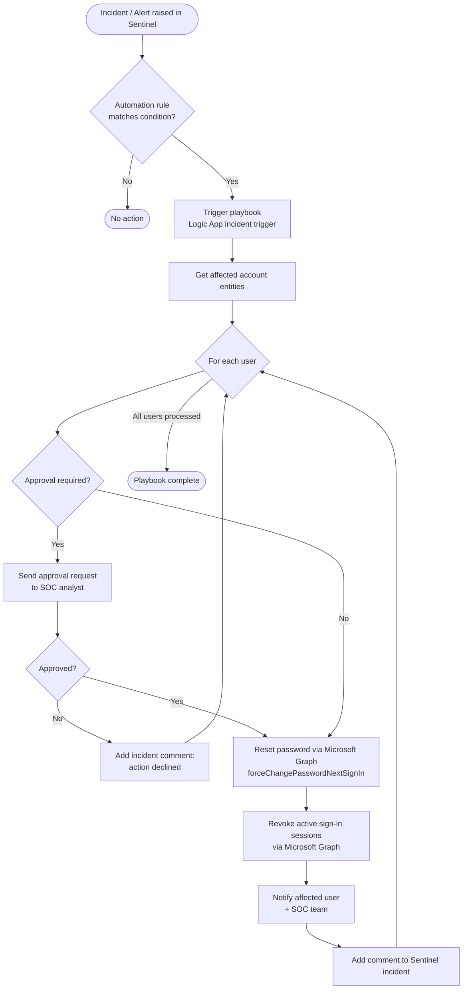

# Password Reset Playbook - Flowchart

This Mermaid diagram renders natively in GitLab. To use it in diagrams.net
(draw.io), open https://app.diagrams.net/ and choose **Arrange > Insert > Advanced > Mermaid**,
then paste the diagram code below.

